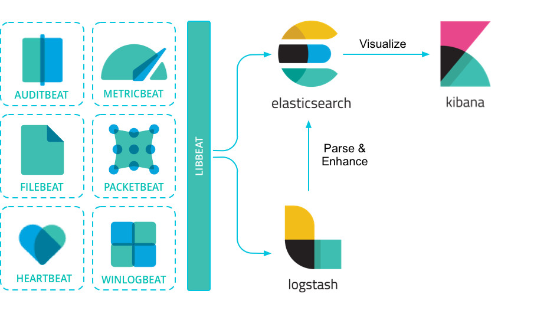
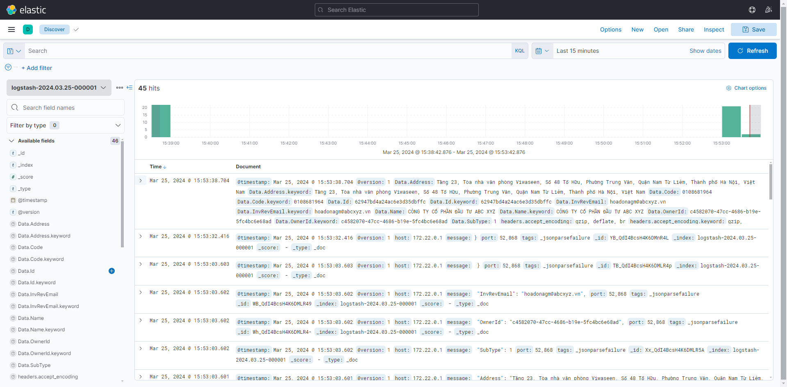
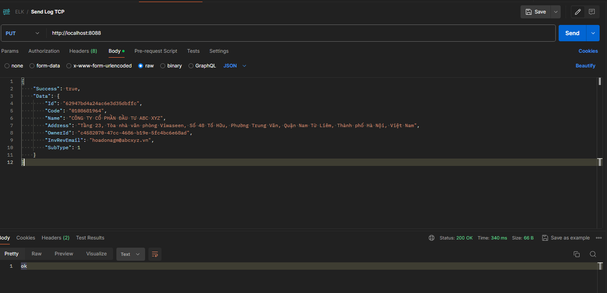

# ELK

Dự án log server, xây dự hệ thống quản lý log tập trung.

## Cài Đặt

`docker compose up`

## Sử Dụng

Truy cập: http://localhost:5601/

## Hình Ảnh

Dưới đây là một hình ảnh minh họa về dự án của bạn:

## Đóng Góp

Hướng dẫn đóng góp vào dự án của bạn.

## Giấy Phép

Thông tin về giấy phép mà dự án của bạn được phát hành.

## Liên Hệ

Thông tin liên hệ của bạn để người dùng có thể liên hệ khi cần hỗ trợ hoặc có câu hỏi.

